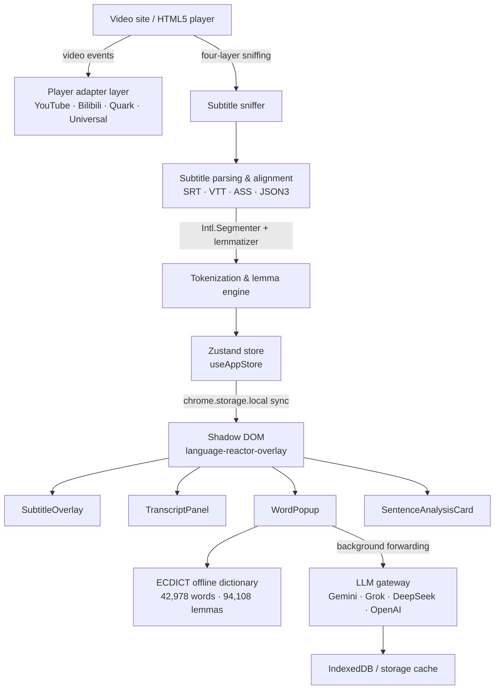

# Glean 拾句

<p align="center">
  <a href="README.md"><b>简体中文</b></a> •
  <a href="README.en.md"><b>English</b></a> •
  <a href="README.ja.md"><b>日本語</b></a>
</p>

<p align="center">
  <a href="https://opensource.org/licenses/MIT"></a>
  <a href="https://wxt.dev"></a>
  <a href="https://tailwindcss.com"></a>
  <a href="https://developer.chrome.com/docs/extensions/mv3/intro/"></a>
  <a href="https://www.typescriptlang.org/"></a>
  
  
  <a href="llms.txt"></a>
</p>

<p align="center">
  
</p>

---

## 📖 Overview

**Glean (拾句)** is a free and open-source browser extension (Chrome Manifest V3) that turns ordinary web videos into an interactive bilingual language-learning workspace. It is built with TypeScript, React 18, Tailwind CSS, Zustand, and WXT.

Glean works on **YouTube**, **Bilibili**, and **Quark Cloud Drive (`pan.quark.cn`)**: subtitles are sniffed automatically, split word by word, highlighted by CEFR level, and clickable for instant definitions. With your own OpenAI-compatible LLM you also get contextual word explanations, sentence-level grammar analysis, and full-episode bilingual translation.

- 🔒 **Privacy first** — the extension is fully useful offline. No account, no sign-up, no analytics. Text leaves the browser only when you explicitly enable an AI feature with your own API key.
- 📦 **Works out of the box** — bundled ECDICT core dictionary (**42,978** words / **94,108** morphological mappings) plus built-in demo subtitles.
- 🌏 **Trilingual UI** — 简体中文, English, and 日本語, switchable at any time.

> 🤖 **AI-friendly** — this repository ships an [llms.txt](llms.txt) context file with machine-readable data contracts and architecture notes for LLM coding agents.

---

## 📸 Screenshots & Showcase

### 1. 🎬 Immersive Bilingual Subtitles & Live Teleprompter
> Real-time subtitle sniffing with native `Intl.Segmenter` tokenization and CEFR difficulty coloring. The right-hand teleprompter stays synced with sub-second accuracy, supporting click-to-seek and single-sentence loop practice.

<p align="center">
  
</p>

### 2. 📖 Instant Word Popup & AI Contextual Analysis
> Click any word in the subtitles for an instant definition card. Powered by the offline ECDICT core dictionary and enhanced by streaming LLM analysis of speaker intent, syntactic role, register, and natural translation.

<p align="center">
  
</p>

### 3. 🛡️ Native Player Bar Integration (Zero Clutter)
> Adheres strictly to the zero-screen-clutter principle with no permanent overlay bars. Feature toggles mount seamlessly into the host player's native control bar, fading in and out naturally.

<p align="center">
  
</p>

### 4. ☁️ Quark Cloud Drive Player Adaptation
> Full support for the Quark Cloud Drive web player (`pan.quark.cn`), extracting embedded subtitles and rendering bilingual lines with mixed gloss annotations for watching cloud resources.

<p align="center">
  
</p>

### 5. 📂 Local Subtitle Import & Built-in Demos
> Watching a video without subtitles? Drag and drop or load external `.srt`, `.vtt`, `.ass`, or `.txt` files directly, or test features instantly with built-in bilingual demo subtitles.

<p align="center">
  
</p>

---

## ✨ Key Features

### 1. 🎬 Interactive Bilingual Subtitle Overlay

- **Word-level interactivity** — tokenization via the native `Intl.Segmenter`; every word is a click target with no perceptible lag.
- **CEFR & mastery coloring** — vocabulary is highlighted by CEFR band (`A1`–`C2`) and by your mastery state (`new`, `learning`, `known`, `mastered`).
- **5-state subtitle cycle (<kbd>C</kbd>)** — `both` ➔ `mixed` ➔ `target` ➔ `translation` ➔ `hidden`.
- **One-key subtitle toggle (<kbd>V</kbd>)** — instantly hide or restore every subtitle layer; the preference persists.
- **Frosted listening mask mode** — blur the translation line or the target line until hovered, so you train your ear before your eyes.
- **Shadow DOM isolation** — every UI element lives inside the `<language-reactor-overlay>` shadow root, so host-site CSS can never leak in, and Glean never leaks into the host page.
- **Safe dragging** — the subtitle capsule is draggable within guard boundaries, remembers its vertical position, and resets to the default spot on double-click.

### 2. 📖 Word Card & Offline Dictionary

- **Bundled ECDICT core dictionary** — **42,978** high-frequency entries plus **94,108** lemma mappings (irregular plurals, verb forms, participles, comparatives), giving instant lookups with no network round trip.
- **Three structured tabs**
  - **✨ Meaning** — IPA, part of speech, Collins stars, CEFR level, concise offline definitions, plus a streaming AI explanation of the word in the current sentence.
  - **💬 Examples** — the current dialogue context, curated bilingual example sentences, and AI-generated extended examples on demand.
  - **📚 Grammar & nuance** — the word's syntactic role in this very sentence, collocations, and comparisons with near-synonyms.
- **Pronunciation 🔊** — TTS playback with online dictionary audio fallback.
- **Vocabulary notebook** — save words, mark mastery state, then review and export them from the side panel.

### 3. 🤖 Optional AI Enhancement

- **Contextual word analysis** — explains what the word actually means *in this sentence*, plus speaker intent, register, and grammatical role.
- **Deep sentence analysis** — authentic translation and tone, clause-by-clause syntactic breakdown, idioms and collocations, and connected-speech listening tips.
- **Full-episode bilingual translation & mixed mode** — the AI translates the whole transcript in the background through a playback-aware priority queue (`PriorityBatchQueue`): the sentence you are currently watching is translated first, and seeking re-prioritizes the queue immediately.
- **Mixed mode (`mixed`)** — keeps the original line and glosses only the meaningful words and phrases inline, with configurable gloss density (`low` / `standard` / `high`).
- **Layered graceful degradation** — AI stream ➔ local cache (IndexedDB / `chrome.storage`) ➔ ECDICT offline core ➔ lemma normalizer ➔ safe fallback. Timeouts, rate limits, or a missing key never freeze the UI.
- **MV3 CORS proxy** — content-script requests are forwarded through the background service worker, so self-hosted or third-party OpenAI-compatible gateways work without CORS failures.
- **Connection test & model discovery** — choose a preset, list its models, and measure latency before you start learning.

### 4. 📑 Transcript Panel, Repeat & Export

- **Real-time teleprompter** — the current line is highlighted and centered through binary search (`O(log n)`).
- **Click to seek** — click any line to jump the video to that timestamp.
- **Episode vocabulary** — automatically extracts the notable vocabulary of the current video, sorted by frequency and difficulty.
- **Repeat training** — <kbd>S</kbd> replays the current sentence, <kbd>Z</kbd> latches an endless single-sentence loop, and auto-pause-after-sentence stops the video at the end of every cue so each line becomes a shadowing drill.
- **Subtitle time offset** — nudge subtitle timing in 0.5s steps when a source is slightly out of sync (<kbd>[</kbd> / <kbd>]</kbd>).
- **Export** — transcript as SRT / TXT / CSV / JSON / Anki TSV / Word / PDF; vocabulary notebook as TXT / CSV / JSON / Anki TSV / Word / PDF.

### 5. 🛡️ Four-Layer Subtitle Sniffing

Built to survive encrypted players, asynchronously mounted DOM wrappers, and blob URLs. Each layer takes over when the previous one fails:

1. **Layer 1 · HTML5 native `video.textTracks`** — highest authority; when a track is `disabled`, Glean switches it to `hidden` to make the browser parse cues, then extracts every cue with its timings.
2. **Layer 2 · Dynamic `<track>` and Blob sniffing** — a `MutationObserver` catches later-inserted `<track src="blob:...">` nodes and `fetch`es the raw SRT/VTT payload.
3. **Layer 3 · Main-world network hook** — a tiny hook injected into the page context intercepts `fetch` / `XMLHttpRequest` responses such as YouTube `/timedtext` (JSON3) and Bilibili subtitle APIs.
4. **Layer 4 · Real-time DOM fallback** — strictly filtered DOM observation (player controls, toolbars, buttons, and menus are excluded) with anti-deadlock guards: once a full subtitle source is loaded, DOM fragments stop overwriting it, so UI text can never pollute the transcript.

Supporting stability work:

- **Ad isolation** — during YouTube pre-roll/mid-roll ads Glean shows the ad captions, then restores the real video's subtitles and title the moment the ad ends.
- **Cross-video isolation** — switching episodes or routes immediately clears the previous video's cues, playback position, and AI translation state.

### 6. 📦 Subtitle Import & Demo

- **Drag & drop local subtitles** — drop a `.srt` / `.vtt` / `.ass` / `.txt` file onto the page to load it (a click-to-import entry point is also available).
- **Built-in demo subtitles** — load a bilingual sample with one click and try every feature without any configuration.
- **Switchable subtitle sources** — move freely between auto-sniffed subtitles and locally imported files.

---

## 🌐 Supported Sites

| Site | Status | Notes |
| :--- | :---: | :--- |
| **YouTube** | ✅ Supported | `/timedtext` sniffing + JSON3 alignment + rolling ASR caption merging/dedup + ad-caption isolation |
| **Bilibili** | ✅ Supported | Player adapter for video watch pages, main-world subtitle API sniffing, and the same control-bar/sidebar layout as YouTube |
| **Quark Cloud Drive** (`pan.quark.cn`) | ✅ Supported | Player-page sniffing plus `textTracks` extraction and native control-bar mounting |
| **localhost / 127.0.0.1** | 🧪 Dev only | Whitelisted for local development and automated tests |

> The extension only injects on the sites above. No UI is mounted anywhere else.

---

## ⌨️ Keyboard Shortcuts

| Shortcut | Action | Notes |
| :---: | :--- | :--- |
| <kbd>A</kbd> | Previous line | Jump to the cue before the current one |
| <kbd>D</kbd> | Next line | Jump to the cue after the current one |
| <kbd>S</kbd> | Replay current line | Restart the current cue immediately |
| <kbd>Z</kbd> | Toggle single-line loop | Latch the endless "repeat this sentence" shadowing mode |
| <kbd>Space</kbd> | Play / pause | — |
| <kbd>W</kbd> | Toggle translation line | Quickly show or hide the translation row |
| <kbd>V</kbd> | Toggle all subtitles | Hide or restore every subtitle layer |
| <kbd>C</kbd> | Cycle subtitle modes | See "Subtitle Display Modes" below |
| <kbd>E</kbd> | Toggle transcript panel | Expand or collapse the right sidebar |
| <kbd>[</kbd> / <kbd>]</kbd> | Subtitle time offset | Shift subtitle timing by 0.5s per press |

> Shortcuts stand down while a text input is focused, and never hijack <kbd>Ctrl</kbd>/<kbd>Cmd</kbd>/<kbd>Alt</kbd> combinations.

---

## 🎚️ Subtitle Display Modes

Press <kbd>C</kbd> to cycle through these five modes:

| Mode | Value | What you see |
| :--- | :--- | :--- |
| Bilingual | `both` | Full original + translation side by side |
| Mixed | `mixed` | Original line kept, with inline glosses for key words and phrases (density configurable) |
| Target only | `target` | Original language only — ideal for extensive and intensive listening |
| Translation only | `translation` | Translation only — fastest way to follow the plot |
| Hidden | `hidden` | All subtitles hidden (<kbd>V</kbd> restores the previous state) |

---

## 🏗️ Architecture Overview



---

## 🚀 Quick Start

### Prerequisites

- [Bun](https://bun.sh/) (recommended) or Node.js 18+
- Google Chrome or Microsoft Edge (Chromium-based)

### 1. Clone and build

```bash
git clone https://github.com/JustNowJustLike/Glean.git
cd Glean

bun install        # install dependencies
bun run build      # build the Chrome Manifest V3 bundle
```

The compiled extension is written to `.output/chrome-mv3`.

### 2. Load the extension

1. Open `chrome://extensions/` (or `edge://extensions/` in Edge).
2. Turn on **Developer mode** in the top-right corner.
3. Click **Load unpacked**.
4. Select the `.output/chrome-mv3` folder inside this project.
5. Open any supported video page — the subtitle overlay and transcript panel appear automatically. 🎉

### 3. Scripts

| Command | Purpose |
| :--- | :--- |
| `bun run dev` | WXT dev mode (Chrome, hot reload) |
| `bun run dev:firefox` | WXT dev mode (Firefox) |
| `bun run build` | Production build (Chrome MV3) |
| `bun run build:firefox` | Production build (Firefox) |
| `bun run zip` | Package a store-ready zip |
| `bun run compile` | TypeScript type check |
| `npx playwright test` | Run the Playwright end-to-end suites in `e2e/` (they load `.output/chrome-mv3`, so build first) |

---

## ⚙️ AI Configuration (Optional)

The offline dictionary works with **zero configuration**. To unlock the AI features:

1. Click the extension icon in the toolbar, or open **⚙️ Settings** on the video page.
2. Pick a preset (or choose *Custom* and enter any OpenAI-compatible endpoint):

| Preset | Endpoint | Default model |
| :--- | :--- | :--- |
| Google Gemini (default) | `https://generativelanguage.googleapis.com/v1beta/openai` | `gemini-2.5-flash` |
| Grok2API | `https://grok2api.defiy.top/v1` | `grok-4.6` |
| Sub2API | `https://sub2api.defiy.top/v1` | `gpt-4o` |
| DeepSeek | `https://api.deepseek.com/v1` | `deepseek-chat` |
| OpenAI | `https://api.openai.com/v1` | `gpt-4o-mini` |
| Custom | any OpenAI-compatible endpoint | any model name |

3. Enter your own `API Key` and click **Save & Test Connection** — Glean fetches the model list and reports the response latency.
4. With a custom gateway, Chrome asks you to authorize that origin once (`chrome.permissions`); requests are then forwarded through the background service worker to avoid CORS restrictions.

> 🔐 Your API key is stored only in local `chrome.storage.local` and is sent only to the provider you selected. This project runs no intermediary server.

---

## 📂 Project Structure

```
src/
├── entrypoints/
│   ├── content.ts            # Injection entry: mounts the Shadow DOM UI, listens to video events, cleans up on route changes
│   ├── mainWorld.content.ts  # Main-world hook: intercepts YouTube / Bilibili subtitle APIs
│   ├── background.ts         # MV3 service worker: cross-origin forwarding and message routing
│   └── popup/                # Toolbar popup: UI language, AI presets, connection test
├── core/
│   ├── player/               # Player adapters: YouTube / Bilibili / Quark / Universal
│   ├── subtitle/             # parser, tokenizer, syncEngine, demo subtitles
│   ├── youtube/ bilibili/ quark/   # Per-site subtitle sniffers and title sanitizing
│   ├── dictionary/           # ECDICT core dictionary, lemmatizer, AI explanations and cache
│   ├── ai/                   # Bilingual translation, mixed glossing, priority queue, sentence analysis, semantic segmentation
│   ├── api/                  # LLM client and custom-origin permission handling
│   ├── export/               # Transcript / vocabulary export (SRT · CSV · JSON · Anki · Word · PDF)
│   └── i18n/                 # 简体中文 / English / 日本語 strings
├── store/useAppStore.ts      # Zustand state + chrome.storage persistence and cross-context sync
├── ui/components/            # React components, all mounted inside the shadow root
└── types/index.ts            # Shared types and AI preset constants
e2e/                          # Playwright end-to-end tests
public/icon/                  # Extension icons (16 / 32 / 48 / 96 / 128)
```

---

## 🤖 AI-Friendly Data Contracts

This repository follows the [llms.txt](https://llmstxt.org/) convention. The core data structures live in `src/types/index.ts` so AI coding agents can extend the extension directly.

```typescript
/** A single subtitle line */
interface SubtitleCue {
  id: number;
  start: number;            // start time (seconds)
  end: number;              // end time (seconds)
  textEn: string;           // original text
  textZh: string;           // translation
  tokens?: WordToken[];     // tokenized, clickable words
  mixedPhrases?: PhraseGlossItem[]; // inline glosses used by mixed mode
  isAiRefined?: boolean;    // translated/refined by AI
}

/** A clickable word token */
interface WordToken {
  id: string;
  text: string;             // displayed text
  isWord: boolean;          // whether it can be looked up
  lemma?: string;           // dictionary lemma
  level?: MasteryLevel;     // 'new' | 'learning' | 'known' | 'mastered'
  cefr?: CEFRLevel;         // 'A1' – 'C2'
  contextMeaning?: string;  // meaning in this context
  phraseId?: string;        // owning phrase
}

/** User settings (excerpt) */
interface AppSettings {
  aiProvider: 'sub2api' | 'grok' | 'deepseek' | 'openai' | 'google' | 'custom';
  apiBaseUrl: string;
  modelName: string;
  uiLanguage?: 'zh-CN' | 'en' | 'ja';
  primaryLang: 'en';
  secondaryLang: string;    // 'auto' | 'zh-CN' | 'en' | 'ja' | ...
  subtitleMode: 'both' | 'mixed' | 'target' | 'translation' | 'hidden';
  mixedGlossDensity?: 'low' | 'medium' | 'high';
  maskChinese: boolean;     // frosted listening mask
  maskEnglish: boolean;
  autoPauseAfterSentence: boolean;
  subtitleTimeOffset: number;
  hotkeys: Record<string, string>;
}

/** Result of AI sentence analysis */
interface SentenceDeepAnalysis {
  sentenceEn: string;
  sentenceZh: string;
  authenticTranslation: string;
  contextTone: string;
  syntacticBreakdown: SentenceSyntacticBreakdown[];
  idiomsAndPhrases: SentenceIdiomOrPhrase[];
  pronunciationTips: SentencePronunciationTip[];
}
```

---

## 🔒 Privacy & Permissions

- **Local storage** — settings, the vocabulary notebook, and cached AI explanations are stored in `chrome.storage.local` / IndexedDB, and are removed by the browser when the extension is uninstalled.
- **Permissions**
  - `storage`: saves settings and cache data.
  - `activeTab`: reads the playback state of the current tab.
  - Site access: YouTube / Bilibili / Quark Cloud Drive, used to read video elements and subtitle sources.
  - AI provider access: requests are sent only after you enable an AI feature and enter a key; custom gateways require an explicit `chrome.permissions` prompt for that origin.
- **What Glean never does** — no personal data collection, no ads, no data selling, no account required.
- See [PRIVACY.md](PRIVACY.md) for the full policy and [STORE_LISTING.md](STORE_LISTING.md) for the store listing text.

---

## ❓ FAQ

**The video shows no subtitles. What now?**
First check whether the site offers captions at all. If none of the four sniffing layers finds a source, drag and drop a local `.srt` / `.vtt` / `.ass` / `.txt` file, or click "Load demo subtitles" to explore the features.

**AI requests keep failing.**
When no key is configured or the network is unavailable, Glean falls back to the offline dictionary instead of freezing. Check the API key, endpoint, and account quota, then use "Test connection" in settings. With a custom gateway, make sure you granted access to that origin.

**Is English the only target language?**
The original-language track is currently English-first (`primaryLang: 'en'`). Translation targets include auto (bidirectional), Simplified Chinese, Traditional Chinese, English, Japanese, Korean, French, German, Spanish, and Russian.

**Is Firefox supported?**
The repo ships a `bun run build:firefox` script, but the default output and the end-to-end tests currently target Chromium (Manifest V3). Firefox has not been fully verified yet.

**Will the shortcuts clash with site shortcuts?**
Glean never hijacks <kbd>Ctrl</kbd>/<kbd>Cmd</kbd>/<kbd>Alt</kbd> combinations and stays silent while a text input is focused.

---

## 🤝 Contributing

Issues and pull requests are very welcome. Please run these locally before submitting:

```bash
bun run compile   # type check
bun run build     # build smoke test
```

---

## 📄 License

Released under the [MIT License](LICENSE) — free to use, modify, and distribute.

If Glean helps you, a ⭐ Star would be much appreciated!