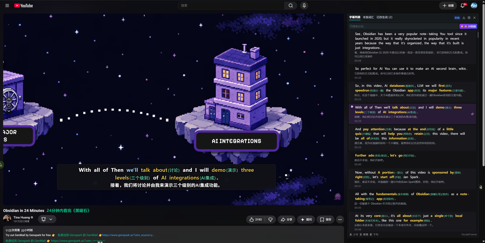
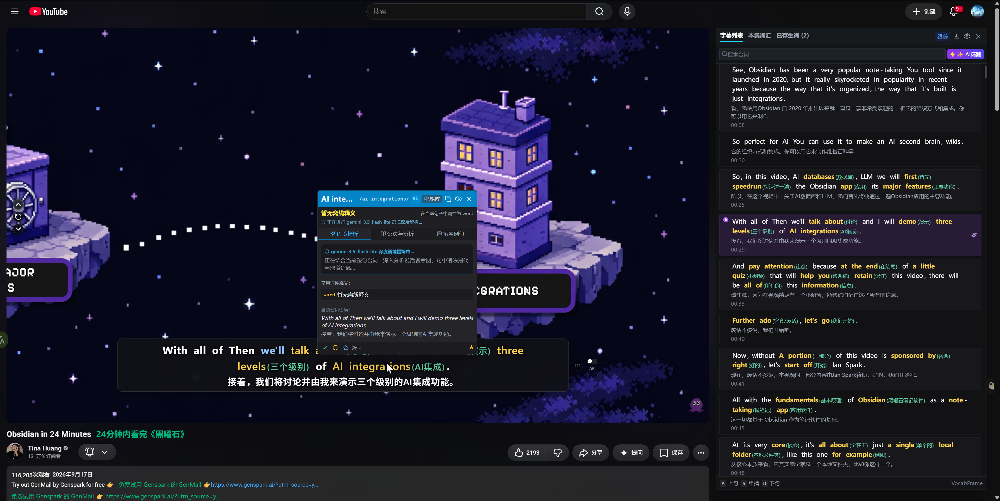
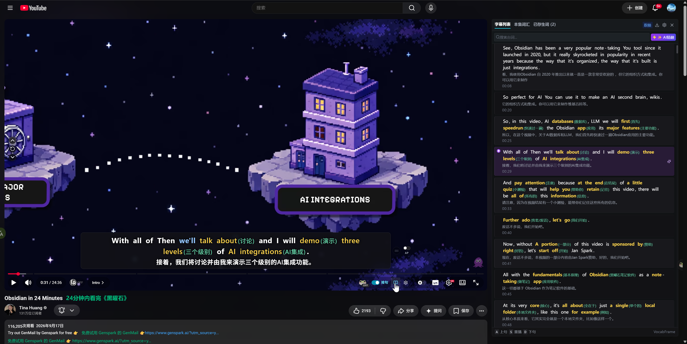
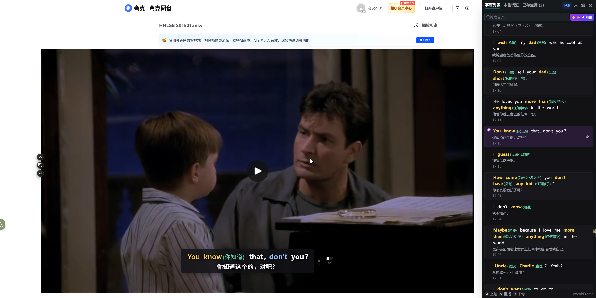
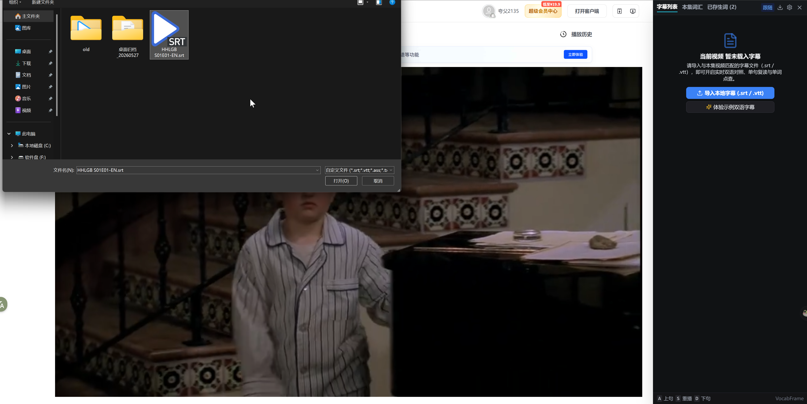
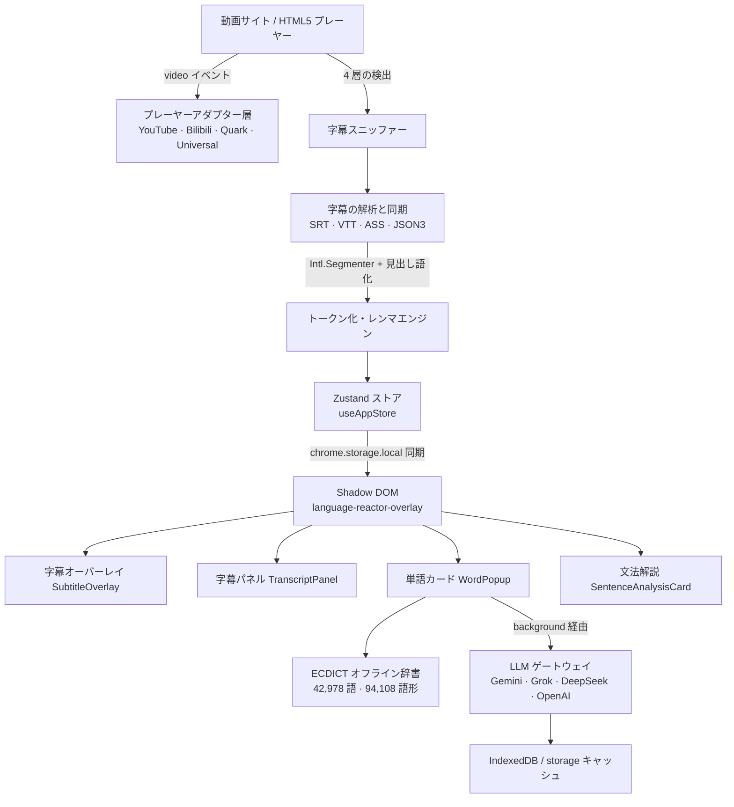

# Glean 拾句

<p align="center">
  <a href="README.md"><b>简体中文</b></a> •
  <a href="README.en.md"><b>English</b></a> •
  <a href="README.ja.md"><b>日本語</b></a>
</p>

<p align="center">
  <a href="https://opensource.org/licenses/MIT"></a>
  <a href="https://wxt.dev"></a>
  <a href="https://tailwindcss.com"></a>
  <a href="https://developer.chrome.com/docs/extensions/mv3/intro/"></a>
  <a href="https://www.typescriptlang.org/"></a>
  
  
  <a href="llms.txt"></a>
</p>

<p align="center">
  
</p>

---

## 📖 プロジェクト概要

**Glean（拾句）** は、無料・オープンソースの没入型バイリンガル動画学習ブラウザ拡張機能（Chrome Manifest V3）です。TypeScript・React 18・Tailwind CSS・Zustand・WXT で構築されています。

**YouTube**、**Bilibili**、**Quark クラウドストレージ（`pan.quark.cn`）** の動画を、クリックで調べられ、リピートでき、AI で精訳できる学習環境に変えます。字幕は自動で検出され、単語単位でクリック可能、CEFR レベル別に色分けされます。独自の OpenAI 互換 LLM を接続すれば、文脈に応じた単語解説・文法の分解・全編バイリンガル精訳も利用できます。

- 🔒 **プライバシー最優先** — オフラインのみでも十分に使えます。アカウント登録・ログイン・解析トラッキングは一切ありません。AI 機能を自分で有効にし、自分の API キーを入力したときだけ、必要なテキストが選択したプロバイダーへ送信されます。
- 📦 **すぐに使える** — ECDICT コア辞書（**42,978** 語 / **94,108** 件の語形変化マッピング）とデモ用バイリンガル字幕を同梱しています。
- 🌏 **3 言語 UI** — 简体中文 / English / 日本語 をいつでも切り替え可能。

> 🤖 **AI フレンドリー** — リポジトリには [llms.txt](llms.txt) があり、機械可読なデータ契約とアーキテクチャ情報を提供します。

---

## 📸 画面プレビュー / スクリーンショット

### 1. 🎬 没入型二言語字幕とリアルタイムテレプロンプター
> 動画字幕を自動検出し、標準の `Intl.Segmenter` で単語分割と CEFR 難易度色分け。右側の字幕パネルは再生位置にリアルタイム追従し、文クリックによるジャンプや単句リピート練習に対応。

<p align="center">
  
</p>

### 2. 📖 単語クリック即時ポップアップと AI 文脈解析
> 字幕内の任意の単語をクリックすると即座にカードを表示。オフラインの ECDICT コア辞書に加え、LLM による文脈・話し手の意図・文法構造・自然なニュアンスのストリーミング解析に対応。

<p align="center">
  
</p>

### 3. 🛡️ プレーヤー標準コントロールバーへの軽量マウント
> 動画画面を邪魔しないゼロ・クラッター設計。常駐ツールバーを排除し、YouTube 等のネイティブ操作バー内にスイッチを自然に統合。

<p align="center">
  
</p>

### 4. ☁️ Quark クラウドストレージへのネイティブ対応
> Quark（夸克网盘）Web プレーヤー（`pan.quark.cn`）を完全サポート。クラウド動画の内蔵字幕を検出し、二言語および中英ミックス注釈で快適に学習できます。

<p align="center">
  
</p>

### 5. 📂 外部ローカル字幕の読み込みとデモ体験
> 字幕のない動画でも、`.srt` / `.vtt` / `.ass` / `.txt` ファイルをドラッグ＆ドロップで手軽に追加可能。ワンクリックで試せるデモ用二言語字幕も内蔵。

<p align="center">
  
</p>

---

## ✨ 主な機能

### 1. 🎬 インタラクティブな二言語字幕オーバーレイ

- **単語単位のクリック操作** — ブラウザ標準の `Intl.Segmenter` による分割で、字幕の各単語がクリック可能。ほぼ遅延なく単語カードが開きます。
- **CEFR と習得度のハイライト** — CEFR レベル（`A1`–`C2`）と習得状態（`新規` / `学習中` / `既知` / `習得済み`）に応じて色分け表示。
- **5 状態の字幕サイクル（<kbd>C</kbd>）** — `両方` ➔ `中英ミックス` ➔ `ターゲットのみ` ➔ `翻訳のみ` ➔ `非表示`。
- **字幕のワンキー表示/非表示（<kbd>V</kbd>）** — すべての字幕レイヤーを瞬時に切り替え、設定は自動保存されます。
- **リスニング用すりガラスマスク** — 翻訳行または原文行をぼかし、マウスオーバー時のみ表示。「まず耳で聞く」トレーニングに最適です。
- **Shadow DOM によるスタイル分離** — UI はすべて `<language-reactor-overlay>` の Shadow Root 内にマウントされ、ホストサイトの CSS と相互に干渉しません。
- **安全なドラッグ** — 字幕バーは範囲制限付きで上下にドラッグでき、位置は自動記憶。ハンドルをダブルクリックすると既定位置に戻ります。

### 2. 📖 単語カードとオフライン辞書

- **ECDICT コア辞書を内蔵** — **42,978** 語の高頻度見出し語と **94,108** 件の語形変化マッピング（不規則複数形・動詞活用・分詞・比較級/最上級）を同梱。オフラインでも即座に意味を表示します。
- **3 つのタブ**
  - **✨ 意味** — 国際音声記号（IPA）、品詞、コリンズ星評価、CEFR レベル、オフライン簡潔释义に加え、AI による「この文での文脈解説」をストリーミング表示。
  - **💬 例文** — 現在のセリフの文脈、厳選された二言語例文、そして必要に応じた AI の「拡張例文」。
  - **📚 文法とニュアンス** — この文中での文法的役割、コロケーション（共起表現）、類義語との使い分け。
- **発音 🔊** — TTS 読み上げに対応し、オンライン辞書の音声にもフォールバックします。
- **単語帳** — 単語を保存し習得度を記録。サイドパネルで復習・書き出しができます。

### 3. 🤖 オプションの AI 強化機能

- **単語の文脈解析** — 「この文でこの単語が実際に何を意味するか」を、話し手の意図・語調・文法的役割とともに解説します。
- **文単位の詳細分析** — 自然な訳と語調、構成要素ごとの文法分解、イディオムとコロケーション、連結音などのリスニングのヒント。
- **全編バイリンガル精訳と中英ミックスモード** — 字幕全体をバックグラウンドでストリーミング翻訳し、再生位置を考慮した優先度キュー（`PriorityBatchQueue`）で「今見ている文」を最優先で差し替えます。シーク操作時はキューを即座に並べ替えます。
- **中英ミックスモード（`mixed`）** — 原文を残しつつ、重要な単語とフレーズだけを行内で注釈。注釈密度は `低 / 標準 / 高` から選択できます。
- **多層フォールバック** — AI ストリーム ➔ ローカルキャッシュ（IndexedDB / `chrome.storage`）➔ ECDICT オフラインコア ➔ 語形変化エンジン ➔ 安全な代替表示。タイムアウトやレート制限、API キー未設定でも UI が固まりません。
- **MV3 CORS プロキシ** — content script のリクエストは background service worker 経由で転送されるため、自作・第三者製の OpenAI 互換ゲートウェイも CORS エラーなしで利用できます。
- **接続テストとモデル一覧** — プリセットを選び、モデル一覧の取得とレイテンシ計測ができます。

### 4. 📑 字幕パネル・リピート・書き出し

- **リアルタイムテレプロンプター** — 二分探索（`O(log n)`）で再生位置と同期し、現在のセリフを自動で中央にハイライトします。
- **クリックでシーク** — 任意のセリフをクリックするとその時刻へジャンプします。
- **エピソード語彙リスト** — その動画の重要語彙を出現頻度と難易度順に自動抽出します。
- **リピート練習** — <kbd>S</kbd> で現在の文を再生し直し、<kbd>Z</kbd> で 1 文ループを固定。さらに「1 文ごとに自動一時停止」を有効にすれば、すべてのセリフがシャドーイング練習になります。
- **字幕タイムオフセット** — 字幕がずれている場合は 0.5 秒刻みで前後に調整できます（<kbd>[</kbd> / <kbd>]</kbd>）。
- **書き出し** — 全編スクリプトを SRT / TXT / CSV / JSON / Anki TSV / Word / PDF で、単語帳を TXT / CSV / JSON / Anki TSV / Word / PDF で出力できます。

### 5. 🛡️ 4 層の字幕検出アーキテクチャ

暗号化されたプレーヤー、非同期に挿入される DOM、blob URL に対抗するために設計しています。上位の層から順にフォールバックします：

1. **第 1 層 · HTML5 標準の `video.textTracks`** — 最優先。トラックが `disabled` の場合は `hidden` に切り替えてブラウザに cues を解析させ、開始・終了時刻とセリフを一括取得します。
2. **第 2 層 · 動的な `<track>` と Blob の監視** — `MutationObserver` で後から挿入された `<track src="blob:...">` を検出し、生の SRT/VTT を `fetch` します。
3. **第 3 層 · メインワールドのネットワークフック** — ページコンテキストに注入した軽量フックで `fetch` / `XMLHttpRequest` を傍受し、YouTube の `/timedtext`（JSON3）や Bilibili の字幕 API のレスポンスを取得します。
4. **第 4 層 · リアルタイム DOM フォールバック** — コントロールバー・ツールバー・ボタン・メニューを厳密に除外した DOM 監視。完全な字幕ソースを取得した後は DOM 断片による上書きを停止し、偽のセリフ混入を防ぎます（デッドロック防止付き）。

安定性のための追加設計：

- **広告再生中の分離** — YouTube の広告中は広告の字幕を表示し、広告終了と同時に本編の字幕とタイトルへシームレスに復帰します。
- **動画をまたぐ状態の分離** — エピソードやルートの切り替えを検出すると、前の動画のセリフ・再生位置・AI 精訳の状態を即座に破棄します。

### 6. 📦 字幕の読み込みとデモ

- **ローカル字幕のドラッグ＆ドロップ** — `.srt` / `.vtt` / `.ass` / `.txt` をページにドロップするだけで読み込めます（クリックでの読み込みも可能）。
- **デモ字幕を内蔵** — ワンクリックで二言語サンプルを読み込み、設定なしで全機能を試せます。
- **字幕ソースの切り替え** — 自動検出した字幕とローカルで読み込んだ字幕をいつでも切り替えられます。

---

## 🌐 対応サイト

| サイト | 対応状況 | 内容 |
| :--- | :---: | :--- |
| **YouTube** | ✅ 対応 | `/timedtext` の検出 + JSON3 同期 + 自動生成字幕の結合・重複除去 + 広告字幕の分離 |
| **Bilibili** | ✅ 対応 | 動画視聴ページのプレーヤー対応、メインワールドでの字幕 API 傍受、YouTube と統一したコントロールバー／サイドバー |
| **Quark クラウドストレージ**（`pan.quark.cn`） | ✅ 対応 | 再生ページの字幕検出と `textTracks` 取得、ネイティブコントロールバーへのマウント |
| **localhost / 127.0.0.1** | 🧪 開発用 | ローカル開発と自動テスト用のホワイトリスト |

> 上記のサイトにのみスクリプトを注入します。それ以外のサイトでは UI は一切マウントされません。

---

## ⌨️ キーボードショートカット

| ショートカット | 機能 | 補足 |
| :---: | :--- | :--- |
| <kbd>A</kbd> | 前のセリフ | 現在の 1 つ前のセリフへ移動 |
| <kbd>D</kbd> | 次のセリフ | 現在の 1 つ後のセリフへ移動 |
| <kbd>S</kbd> | 現在のセリフを再生し直す | 現在のセリフを頭から再再生 |
| <kbd>Z</kbd> | 1 文ループの切り替え | 「現在の文を無限リピート」するシャドーイングモードを固定 |
| <kbd>Space</kbd> | 再生 / 一時停止 | — |
| <kbd>W</kbd> | 翻訳行の表示切り替え | 訳文の行を素早く表示・非表示 |
| <kbd>V</kbd> | 字幕全体の表示切り替え | すべての字幕レイヤーを一括で切り替え |
| <kbd>C</kbd> | 字幕モードの循環 | 下記「字幕表示モード」を参照 |
| <kbd>E</kbd> | 字幕パネルの開閉 | 右側のサイドバーを開閉 |
| <kbd>[</kbd> / <kbd>]</kbd> | 字幕タイムの微調整 | 1 回ごとに 0.5 秒ずつ前後させます |

> テキスト入力中はショートカットが無効になり、<kbd>Ctrl</kbd>/<kbd>Cmd</kbd>/<kbd>Alt</kbd> の組み合わせを奪うこともありません。

---

## 🎚️ 字幕表示モード

<kbd>C</kbd> を押すと次の 5 モードを順に切り替えます：

| モード | 値 | 表示内容 |
| :--- | :--- | :--- |
| 二言語 | `both` | 原文 + 訳文の完全な対訳 |
| 中英ミックス | `mixed` | 原文を残し、重要な単語とフレーズだけを行内注釈（密度は変更可能） |
| ターゲットのみ | `target` | 原文のみ。多聴・精聴に最適 |
| 翻訳のみ | `translation` | 訳文のみ。内容を素早く把握したいときに |
| 非表示 | `hidden` | 字幕を完全に非表示（<kbd>V</kbd> で直前の状態に復帰） |

---

## 🏗️ アーキテクチャ概要



---

## 🚀 はじめかた

### 動作環境

- [Bun](https://bun.sh/)（推奨）または Node.js 18+
- Google Chrome / Microsoft Edge（Chromium 系）

### 1. 取得とビルド

```bash
git clone https://github.com/futureManOne/Glean.git
cd Glean

bun install        # 依存関係のインストール
bun run build      # Chrome Manifest V3 のプロダクションビルド
```

ビルド成果物は `.output/chrome-mv3` に出力されます。

### 2. ブラウザへの読み込み

1. `chrome://extensions/`（Edge は `edge://extensions/`）を開きます。
2. 右上の **デベロッパー モード** を有効にします。
3. **パッケージ化されていない拡張機能を読み込む** をクリックします。
4. 本プロジェクト内の `.output/chrome-mv3` フォルダを選択します。
5. 対応サイトの動画ページを開くと、字幕オーバーレイと字幕パネルが表示されます。🎉

### 3. 主なスクリプト

| コマンド | 用途 |
| :--- | :--- |
| `bun run dev` | WXT 開発モード（Chrome・ホットリロード） |
| `bun run dev:firefox` | WXT 開発モード（Firefox） |
| `bun run build` | プロダクションビルド（Chrome MV3） |
| `bun run build:firefox` | プロダクションビルド（Firefox） |
| `bun run zip` | ストア申請用の zip を作成 |
| `bun run compile` | TypeScript の型チェック |
| `npx playwright test` | `e2e/` の Playwright E2E テストを実行（`.output/chrome-mv3` を読み込むため、先に `bun run build` を実行してください） |

---

## ⚙️ AI の設定（任意）

オフライン辞書は**設定不要**ですぐ使えます。AI 機能を有効にする場合：

1. ツールバーの拡張アイコンをクリックするか、動画ページの **⚙️ 設定** を開きます。
2. プリセットを選択します（「カスタム」で任意の OpenAI 互換エンドポイントも指定できます）。

| プリセット | エンドポイント | 既定モデル |
| :--- | :--- | :--- |
| Google Gemini（既定） | `https://generativelanguage.googleapis.com/v1beta/openai` | `gemini-2.5-flash` |
| Grok2API | `https://grok2api.defiy.top/v1` | `grok-4.6` |
| Sub2API | `https://sub2api.defiy.top/v1` | `gpt-4o` |
| DeepSeek | `https://api.deepseek.com/v1` | `deepseek-chat` |
| OpenAI | `https://api.openai.com/v1` | `gpt-4o-mini` |
| カスタム | 任意の OpenAI 互換 URL | 任意のモデル名 |

3. 自分の `API Key` を入力し、**保存して接続テスト** をクリックします。モデル一覧の取得とレスポンス遅延が表示されます。
4. カスタムゲートウェイを使う場合、初回のみそのドメインの許可を求められます（`chrome.permissions`）。許可後は background service worker 経由で転送され、CORS の制限を回避できます。

> 🔐 API Key はローカルの `chrome.storage.local` にのみ保存され、選択したプロバイダーにのみ送信されます。本プロジェクトは中継サーバーを一切運用していません。

---

## 📂 プロジェクト構成

```
src/
├── entrypoints/
│   ├── content.ts            # 注入エントリ：Shadow DOM UI のマウント、video イベント監視、ルート変更時のクリーンアップ
│   ├── mainWorld.content.ts  # メインワールドのフック：YouTube / Bilibili の字幕 API を傍受
│   ├── background.ts         # MV3 Service Worker：クロスオリジン転送とメッセージルーティング
│   └── popup/                # ツールバーポップアップ：UI 言語、AI プリセット、接続テスト
├── core/
│   ├── player/               # プレーヤーアダプター：YouTube / Bilibili / Quark / Universal
│   ├── subtitle/             # parser（解析）、tokenizer（分割）、syncEngine（同期）、デモ字幕
│   ├── youtube/ bilibili/ quark/   # サイト別の字幕検出とタイトル整形
│   ├── dictionary/           # ECDICT コア辞書、見出し語化、AI 解説、キャッシュ
│   ├── ai/                   # 二言語精訳、ミックス注釈、優先度キュー、文法解析、意味分割
│   ├── api/                  # LLM クライアントとカスタムドメインの権限処理
│   ├── export/               # スクリプト / 単語帳の書き出し（SRT · CSV · JSON · Anki · Word · PDF）
│   └── i18n/                 # 简体中文 / English / 日本語 の文言
├── store/useAppStore.ts      # Zustand の状態管理 + chrome.storage 永続化とコンテキスト間同期
├── ui/components/            # Shadow Root 内にマウントされる React コンポーネント
└── types/index.ts            # 共有型定義と AI プリセット定数
e2e/                          # Playwright E2E テスト
public/icon/                  # 拡張アイコン（16 / 32 / 48 / 96 / 128）
```

---

## 🤖 AI フレンドリーなデータ契約

本リポジトリは [llms.txt](https://llmstxt.org/) の慣習に従っています。中核となるデータ構造は `src/types/index.ts` に定義されているため、AI コーディングエージェントがそのまま拡張できます。

```typescript
/** 1 つのセリフ */
interface SubtitleCue {
  id: number;
  start: number;            // 開始時刻（秒）
  end: number;              // 終了時刻（秒）
  textEn: string;           // 原文
  textZh: string;           // 訳文
  tokens?: WordToken[];     // 分割済みのクリック可能な単語
  mixedPhrases?: PhraseGlossItem[]; // 中英ミックスモードの行内注
  isAiRefined?: boolean;    // AI による精訳済みか
}

/** クリック可能な単語トークン */
interface WordToken {
  id: string;
  text: string;             // 表示テキスト
  isWord: boolean;          // 検索対象かどうか
  lemma?: string;           // 見出し語（レンマ）
  level?: MasteryLevel;     // 'new' | 'learning' | 'known' | 'mastered'
  cefr?: CEFRLevel;         // 'A1' – 'C2'
  contextMeaning?: string;  // この文脈での意味
  phraseId?: string;        // 所属フレーズ
}

/** ユーザー設定（抜粋） */
interface AppSettings {
  aiProvider: 'sub2api' | 'grok' | 'deepseek' | 'openai' | 'google' | 'custom';
  apiBaseUrl: string;
  modelName: string;
  uiLanguage?: 'zh-CN' | 'en' | 'ja';
  primaryLang: 'en';
  secondaryLang: string;    // 'auto' | 'zh-CN' | 'en' | 'ja' | ...
  subtitleMode: 'both' | 'mixed' | 'target' | 'translation' | 'hidden';
  mixedGlossDensity?: 'low' | 'medium' | 'high';
  maskChinese: boolean;     // リスニング用すりガラスマスク
  maskEnglish: boolean;
  autoPauseAfterSentence: boolean;
  subtitleTimeOffset: number;
  hotkeys: Record<string, string>;
}

/** AI による文の詳細解析結果 */
interface SentenceDeepAnalysis {
  sentenceEn: string;
  sentenceZh: string;
  authenticTranslation: string;
  contextTone: string;
  syntacticBreakdown: SentenceSyntacticBreakdown[];
  idiomsAndPhrases: SentenceIdiomOrPhrase[];
  pronunciationTips: SentencePronunciationTip[];
}
```

---

## 🔒 プライバシーと権限

- **ローカル保存** — 設定、単語帳、AI 解説のキャッシュは `chrome.storage.local` / IndexedDB に保存され、拡張機能を削除するとブラウザの仕様に従って消去されます。
- **権限**
  - `storage`：設定とキャッシュデータの保存。
  - `activeTab`：現在のタブの再生状態の取得。
  - サイト権限：YouTube / Bilibili / Quark クラウドストレージ。動画要素と字幕ソースの取得に使用します。
  - AI プロバイダーへのアクセス：AI 機能を有効にしてキーを入力した後にのみリクエストを送信します。カスタムゲートウェイは `chrome.permissions` による明示的な許可が必要です。
- **行わないこと** — 個人情報の収集、広告の配信、データの販売、アカウント登録の要求は一切ありません。
- 詳細は [PRIVACY.md](PRIVACY.md)、ストア掲載文は [STORE_LISTING.md](STORE_LISTING.md) をご覧ください。

---

## ❓ FAQ

**字幕が表示されません。**
まず配信サイト側に字幕があるか確認してください。4 層の検出で取得できない場合は、ローカルの `.srt` / `.vtt` / `.ass` / `.txt` をドラッグ＆ドロップするか、「デモ字幕を読み込む」で機能をお試しください。

**AI が失敗し続けます。**
キー未設定やネットワーク異常の場合は、オフライン辞書へ自動的にフォールバックするため UI は停止しません。API Key・エンドポイント・残量を確認し、設定の「接続テスト」を実行してください。カスタムゲートウェイの場合はドメインの許可もご確認ください。

**ターゲット言語は英語だけですか？**
原文トラックは現在英語が中心です（`primaryLang: 'en'`）。翻訳先は自動（双方向）、簡体字中国語、繁体字中国語、英語、日本語、韓国語、フランス語、ドイツ語、スペイン語、ロシア語に対応しています。

**Firefox には対応していますか？**
`bun run build:firefox` のビルドスクリプトは用意していますが、既定の成果物と E2E テストは Chromium（Manifest V3）を対象にしており、Firefox は十分な検証ができていません。

**ショートカットはサイト側と競合しませんか？**
<kbd>Ctrl</kbd>/<kbd>Cmd</kbd>/<kbd>Alt</kbd> の組み合わせは奪いません。テキスト入力中も動作しません。

---

## 🤝 コントリビュート

Issue と Pull Request を歓迎します。提出前に以下を実行してください：

```bash
bun run compile   # 型チェック
bun run build     # ビルドのスモークテスト
```

---

## 📄 ライセンス

[MIT License](LICENSE) のもとで公開されています。自由に使用・改変・再配布できます。

Glean が役に立ったら、⭐ Star をいただけると嬉しいです！