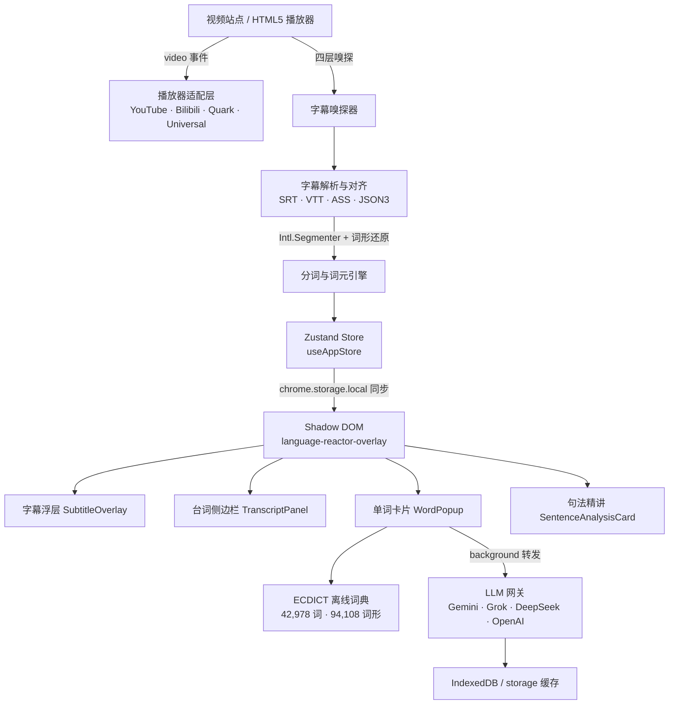

# Glean 拾句

<p align="center">
  <a href="README.md"><b>简体中文</b></a> •
  <a href="README.en.md"><b>English</b></a> •
  <a href="README.ja.md"><b>日本語</b></a>
</p>

<p align="center">
  <a href="https://opensource.org/licenses/MIT"></a>
  <a href="https://wxt.dev"></a>
  <a href="https://tailwindcss.com"></a>
  <a href="https://developer.chrome.com/docs/extensions/mv3/intro/"></a>
  <a href="https://www.typescriptlang.org/"></a>
  
  
  <a href="llms.txt"></a>
</p>

<p align="center">
  
</p>

---

## 📖 项目简介

**Glean（拾句）** 是一款开源、免费、隐私优先的沉浸式双语视频学习浏览器扩展（Chrome Manifest V3），技术栈为 TypeScript + React 18 + Tailwind CSS + Zustand + WXT。

它把 **YouTube**、**Bilibili**、**夸克网盘网页版（`pan.quark.cn`）** 上的普通视频变成可点、可查、可跟读、可精翻的语言学习现场：字幕自动嗅探、逐词可点、按 CEFR 等级着色，点击任意单词即刻出词卡；你也可以接入自己的 OpenAI 兼容大模型，获得单词语境精析、句子语法拆解与全片双语精翻。

- 🔒 **隐私优先** — 完全不依赖云端也能使用：无需注册、无需登录、无统计埋点。只有你主动开启 AI 功能并填入自己的 API Key 时，相关文本才会发送给你所选的服务商。
- 📦 **开箱即用** — 内置 ECDICT 核心离线词库（**42,978** 词条 / **94,108** 条词形还原映射）与演示双语字幕。
- 🌏 **三语界面** — 简体中文 / English / 日本語 一键切换。

> 🤖 **AI 友好** — 仓库内提供 [llms.txt](llms.txt) 上下文文件，包含机器可读的数据契约与架构说明，便于 AI 编程助手二次开发。

---

## 📸 效果展示

### 1. 🎬 沉浸式双语字幕与实时提词器
> 实时嗅探视频字幕，原生 `Intl.Segmenter` 逐词分词与 CEFR 难度着色。右侧提词器毫秒级对齐播放进度，支持点击任意句子跳转与单句跟读循环。

<p align="center">
  
</p>

### 2. 📖 逐词即查生词卡与 AI 深度语境精析
> 点击字幕中的任意单词即刻弹出词卡。内置 ECDICT 离线核心词库，同时支持调用大模型对当前句子语境进行深度剖析（说话人意图、句法指代、语体色彩与地道释义）。

<p align="center">
  
</p>

### 3. 🛡️ 原生控制栏轻量挂载与零遮挡沉浸
> 严格遵循视频画面零干扰原则，无常驻遮挡浮条。功能开关无缝嵌入播放器原生控制条，随控制条自动智能显隐。

<p align="center">
  
</p>

### 4. ☁️ 夸克网盘播放器深度适配
> 全面支持夸克网盘网页版（`pan.quark.cn`），自动捕获网盘视频内嵌字幕，支持中英双语与混合批注模式，网盘视频也能轻松沉浸学习。

<p align="center">
  
</p>

### 5. 📂 本地外挂字幕导入与即时体验
> 遇到没有字幕的视频？支持一键拖拽或选取本地 `.srt` / `.vtt` / `.ass` / `.txt` 字幕，同时内置开箱即用的双语示例字幕。

<p align="center">
  
</p>

---

## ✨ 核心功能

### 1. 🎬 交互式双语字幕浮层

- **逐词可点** — 基于浏览器原生 `Intl.Segmenter` 分词，字幕中每个单词独立可点，点击即出词卡，无感知延迟。
- **CEFR 与掌握度着色** — 按欧标等级（`A1`–`C2`）与你的掌握状态（`新词` / `学习中` / `已认识` / `已掌握`）智能高亮。
- **5 态字幕循环（<kbd>C</kbd>）** — `双语` ➔ `中英混合` ➔ `仅外语` ➔ `仅译文` ➔ `隐藏`。
- **字幕一键显隐（<kbd>V</kbd>）** — 瞬间隐藏或恢复全部字幕层，偏好自动持久化。
- **听力磨砂遮罩** — 把译文行或原文行做虚化处理，鼠标悬停才显形，强制训练"先听后看"。
- **Shadow DOM 样式隔离** — 所有 UI 挂载在 `<language-reactor-overlay>` 的 Shadow Root 内，宿主网站 CSS 无法污染，插件也不会污染宿主页面。
- **安全拖拽** — 字幕条可上下拖动且带边界保护，自动记忆垂直位置，双击手柄恢复默认位置。

### 2. 📖 离线词典与单词卡片

- **内置 ECDICT 核心词库** — **42,978** 条高频词条 + **94,108** 条词形还原映射（不规则复数、动词变形、分词、比较级最高级），断网也能即时出词义。
- **三大选项卡**
  - **✨ 解释** — 国际音标、词性、柯林斯星级、CEFR 等级、离线精简释义，并叠加流式 AI「当前句子语境精析」。
  - **💬 例子** — 当前台词原句语境 + 精选双语例句，可按需触发 AI「拓展例句」。
  - **📚 语法与辨析** — 该词在本句中的语法成分、高频搭配、近义用法辨析。
- **发音 🔊** — TTS 朗读，并支持在线词典音频回退。
- **生词本** — 收藏生词、标注掌握度，在侧边栏集中复习与导出。

### 3. 🤖 可选的 AI 能力增强

- **单词语境精析** — 解释"这个词在这句话里到底是什么意思"，并给出说话人意图、语体色彩与语法角色。
- **单句精讲** — 地道翻译与语气把握、逐成分句法拆解、习语与固定搭配、连读弱读等发音听力提示。
- **全片双语精翻与中英混合模式** — 后台流式翻译整片字幕，并接入播放感知的优先级队列（`PriorityBatchQueue`）：正在播放的句子优先翻译秒级替换；拖动进度条快进快退时立即插队重排。
- **中英混合模式（mixed）** — 保留原句，仅对真正有价值的单词与短语做行内释义，释义密度可选 `低 / 标准 / 高`。
- **多层优雅降级** — AI 实时流 ➔ 本地缓存（IndexedDB / `chrome.storage`）➔ ECDICT 离线核心 ➔ 词形还原引擎 ➔ 兜底展示。网络超时、限流或未配置密钥时界面都不会卡死。
- **MV3 CORS 代理** — content script 的请求统一经 background service worker 转发，自建或第三方 OpenAI 兼容网关也能正常调用。
- **连接测试与模型列表** — 选择预设后可拉取模型清单并测速，确认可用再开始学习。

### 4. 📑 台词侧边栏、跟读与导出

- **实时提词器** — 基于二分查找（`O(log n)`）同步当前时间轴，当前台词自动居中高亮。
- **点句即跳** — 点击任意台词即跳转到对应时间点。
- **本集词汇表** — 自动提取当前视频的重点生词，按出现频次与难度排列。
- **跟读训练** — <kbd>S</kbd> 重播当前句，<kbd>Z</kbd> 锁定单句无限循环，还可开启「单句播完自动暂停」，把每一句都变成口语跟读练习。
- **字幕时间微调** — 当字幕源有偏移时，以 0.5 秒为步长前后校正（<kbd>[</kbd> / <kbd>]</kbd>）。
- **导出** — 全片剧本可导出 SRT / TXT / CSV / JSON / Anki TSV / Word / PDF；生词本可导出 TXT / CSV / JSON / Anki TSV / Word / PDF。

### 5. 🛡️ 四层字幕防御嗅探

专为对抗各类播放器的复杂 DOM、异步挂载与 blob 包装而设计，按优先级层层兜底：

1. **层级 1 · HTML5 原生 `video.textTracks`** — 权威优先级最高；轨道被禁用时主动切到 `hidden` 以促使内核解析 cues，再全量提取起止时间与台词。
2. **层级 2 · 动态 `<track>` 与 Blob 监听** — 用 `MutationObserver` 捕获页面异步插入的 `<track src="blob:...">`，`fetch` 原始 SRT/VTT 文本。
3. **层级 3 · 主世界网络拦截** — 注入到页面主世界的轻量 Hook 拦截 `fetch` / `XMLHttpRequest`，捕获 YouTube `/timedtext`（JSON3）与 Bilibili 字幕接口的回包。
4. **层级 4 · 实时 DOM 兜底** — 严格过滤控制条、工具栏、按钮、菜单等元素，并带防死锁保护：一旦拿到完整字幕源，立即停止 DOM 碎片写入，避免假台词污染。

配套的稳定性设计：

- **广告期隔离** — YouTube 贴片广告播放时临时显示广告字幕，广告结束自动无缝还原正片字幕与标题。
- **跨视频状态隔离** — 检测到切集或路由变化时，立即清空上一集的台词、播放进度与 AI 精翻状态，杜绝数据串台。

### 6. 📦 字幕导入与演示

- **拖拽导入本地字幕** — 直接把 `.srt` / `.vtt` / `.ass` / `.txt` 文件拖到页面上即可加载（点击导入同样可用）。
- **内置演示字幕** — 一键加载双语示例，无需配置即可体验全部功能。
- **字幕源切换** — 网盘/视频站自动嗅探结果与本地导入字幕可随时切换。

---

## 🌐 支持平台

| 平台 | 支持状态 | 说明 |
| :--- | :---: | :--- |
| **YouTube** | ✅ 官方支持 | `/timedtext` 字幕嗅探 + JSON3 对齐 + ASR 滚动字幕合并去重 + 广告期字幕隔离 |
| **Bilibili** | ✅ 官方支持 | 视频详情页播放器适配，主世界字幕接口嗅探，控制条与侧栏界面与 YouTube 保持一致 |
| **夸克网盘**（`pan.quark.cn`） | ✅ 官方支持 | 播放页字幕嗅探与 `textTracks` 提取，网盘播放器原生控制条挂载 |
| **localhost / 127.0.0.1** | 🧪 仅调试 | 本地开发与自动化测试用的白名单 |

> 插件只在上述站点注入运行；其他网站不会挂载任何 UI。

---

## ⌨️ 快捷键

| 快捷键 | 功能 | 说明 |
| :---: | :--- | :--- |
| <kbd>A</kbd> | 上一句 | 跳到当前句之前的字幕 |
| <kbd>D</kbd> | 下一句 | 跳到当前句之后的字幕 |
| <kbd>S</kbd> | 重播当前句 | 立刻从头重播当前这句台词 |
| <kbd>Z</kbd> | 单句循环开关 | 锁定「无限重播当前句」的跟读模式 |
| <kbd>Space</kbd> | 播放 / 暂停 | — |
| <kbd>W</kbd> | 译文行开关 | 快速显示或隐藏翻译行 |
| <kbd>V</kbd> | 字幕总开关 | 一键隐藏 / 恢复所有字幕层 |
| <kbd>C</kbd> | 字幕模式循环 | 见下方「字幕显示模式」 |
| <kbd>E</kbd> | 台词侧边栏开关 | 展开或收起右侧侧边栏 |
| <kbd>[</kbd> / <kbd>]</kbd> | 字幕时间微调 | 每按一次前后偏移 0.5 秒 |

> 输入框聚焦时快捷键自动让位，且不会劫持 <kbd>Ctrl</kbd>/<kbd>Cmd</kbd>/<kbd>Alt</kbd> 组合键。

---

## 🎚️ 字幕显示模式

按 <kbd>C</kbd> 依次循环以下 5 种模式：

| 模式 | 取值 | 显示内容 |
| :--- | :--- | :--- |
| 双语 | `both` | 原文 + 译文完整对照 |
| 中英混合 | `mixed` | 保留原句，只对关键单词与短语做行内释义（密度可调） |
| 仅外语 | `target` | 只显示原文，适合泛听与精听 |
| 仅译文 | `translation` | 只显示译文，适合快速理解剧情 |
| 隐藏 | `hidden` | 完全隐藏字幕（可用 <kbd>V</kbd> 恢复上一次状态） |

---

## 🏗️ 架构概览



---

## 🚀 快速上手

### 环境要求

- [Bun](https://bun.sh/)（推荐）或 Node.js 18+
- Google Chrome / Microsoft Edge（Chromium 内核）

### 1. 获取源码并构建

```bash
git clone https://github.com/futureManOne/Glean.git
cd Glean

bun install        # 安装依赖
bun run build      # 构建 Chrome Manifest V3 生产包
```

构建产物输出到 `.output/chrome-mv3`。

### 2. 加载到浏览器

1. 打开 `chrome://extensions/`（Edge 为 `edge://extensions/`）；
2. 打开右上角的 **开发者模式**；
3. 点击 **加载已解压的扩展程序**；
4. 选择本项目下的 `.output/chrome-mv3` 目录；
5. 打开任意支持的视频页面，即可看到字幕浮层与右侧台词栏。🎉

### 3. 常用脚本

| 命令 | 作用 |
| :--- | :--- |
| `bun run dev` | WXT 开发模式（Chrome，热重载） |
| `bun run dev:firefox` | WXT 开发模式（Firefox） |
| `bun run build` | 生产构建（Chrome MV3） |
| `bun run build:firefox` | 生产构建（Firefox） |
| `bun run zip` | 打包成可上传应用商店的 zip |
| `bun run compile` | TypeScript 类型检查 |
| `npx playwright test` | 运行 `e2e/` 下的 Playwright 端到端测试（会加载 `.output/chrome-mv3`，请先执行 `bun run build`） |

---

## ⚙️ AI 配置（可选）

离线词典开箱即用，**无需任何配置**即可查词。若要启用 AI 能力：

1. 点击浏览器工具栏的扩展图标，或在播放页点击 **⚙️ 设置**；
2. 选择预设服务商（也可选「自定义」填写任意 OpenAI 兼容地址）：

| 预设 | 接口地址 | 默认模型 |
| :--- | :--- | :--- |
| Google Gemini（默认） | `https://generativelanguage.googleapis.com/v1beta/openai` | `gemini-2.5-flash` |
| Grok2API | `https://grok2api.defiy.top/v1` | `grok-4.6` |
| Sub2API | `https://sub2api.defiy.top/v1` | `gpt-4o` |
| DeepSeek | `https://api.deepseek.com/v1` | `deepseek-chat` |
| OpenAI | `https://api.openai.com/v1` | `gpt-4o-mini` |
| 自定义 | 任意 OpenAI 兼容地址 | 任意模型名 |

3. 填入自己的 `API Key`，点击 **保存并测试连接** —— 插件会拉取模型列表并显示响应延迟；
4. 使用自定义网关时，首次会弹出该域名的访问授权（`chrome.permissions`），授权后请求经 background service worker 转发，规避跨域限制。

> 🔐 API Key 仅保存在本地 `chrome.storage.local`，且只发送给你选择的服务商；本项目没有任何自建中转服务器。

---

## 📂 项目结构

```
src/
├── entrypoints/
│   ├── content.ts            # 注入入口：挂载 Shadow DOM UI、视频事件监听、路由切换清理
│   ├── mainWorld.content.ts  # 主世界 Hook：YouTube / Bilibili 字幕接口拦截
│   ├── background.ts         # MV3 Service Worker：跨域转发与消息路由
│   └── popup/                # 工具栏弹窗：界面语言、AI 预设、连接测试
├── core/
│   ├── player/               # 播放器适配层：YouTube / Bilibili / Quark / Universal
│   ├── subtitle/             # 解析 parser、分词 tokenizer、时间轴 syncEngine、演示字幕
│   ├── youtube/ bilibili/ quark/   # 三站字幕嗅探与标题清洗
│   ├── dictionary/           # ECDICT 核心词库、词形还原、AI 释义与缓存
│   ├── ai/                   # 双语精翻、混合释义、优先级队列、句法分析、语义断句
│   ├── api/                  # LLM 客户端与自定义域名权限申请
│   ├── export/               # 台词 / 生词导出（SRT · CSV · JSON · Anki · Word · PDF）
│   └── i18n/                 # 简体中文 / English / 日本語 文案
├── store/useAppStore.ts      # Zustand 全局状态 + chrome.storage 持久化与跨上下文同步
├── ui/components/            # 全部挂载在 Shadow Root 内的 React 组件
└── types/index.ts            # 共享类型定义与 AI 预设常量
e2e/                          # Playwright 端到端测试
public/icon/                  # 扩展图标（16 / 32 / 48 / 96 / 128）
```

---

## 🤖 AI 友好数据契约

仓库遵循 [llms.txt](https://llmstxt.org/) 约定，核心数据结构定义在 `src/types/index.ts`，便于 AI 编程助手直接改写功能。

```typescript
/** 一句台词 */
interface SubtitleCue {
  id: number;
  start: number;            // 起始时间（秒）
  end: number;              // 结束时间（秒）
  textEn: string;           // 原文
  textZh: string;           // 译文
  tokens?: WordToken[];     // 分词结果（逐词可点）
  mixedPhrases?: PhraseGlossItem[]; // 中英混合模式的行内短语释义
  isAiRefined?: boolean;    // 是否已被 AI 精翻
}

/** 词元（可点击的单词） */
interface WordToken {
  id: string;
  text: string;             // 显示文本
  isWord: boolean;          // 是否为可查词
  lemma?: string;           // 词形还原后的原形
  level?: MasteryLevel;     // 'new' | 'learning' | 'known' | 'mastered'
  cefr?: CEFRLevel;         // 'A1' – 'C2'
  contextMeaning?: string;  // 该词的上下文释义
  phraseId?: string;        // 所属短语
}

/** 用户设置（节选） */
interface AppSettings {
  aiProvider: 'sub2api' | 'grok' | 'deepseek' | 'openai' | 'google' | 'custom';
  apiBaseUrl: string;
  modelName: string;
  uiLanguage?: 'zh-CN' | 'en' | 'ja';
  primaryLang: 'en';
  secondaryLang: string;    // 'auto' | 'zh-CN' | 'en' | 'ja' | ...
  subtitleMode: 'both' | 'mixed' | 'target' | 'translation' | 'hidden';
  mixedGlossDensity?: 'low' | 'medium' | 'high';
  maskChinese: boolean;     // 听力磨砂遮罩
  maskEnglish: boolean;
  autoPauseAfterSentence: boolean;
  subtitleTimeOffset: number;
  hotkeys: Record<string, string>;
}

/** AI 单句精讲结果 */
interface SentenceDeepAnalysis {
  sentenceEn: string;
  sentenceZh: string;
  authenticTranslation: string;
  contextTone: string;
  syntacticBreakdown: SentenceSyntacticBreakdown[];
  idiomsAndPhrases: SentenceIdiomOrPhrase[];
  pronunciationTips: SentencePronunciationTip[];
}
```

---

## 🔒 隐私与权限

- **本地存储** — 设置项、生词本与 AI 解释缓存保存在 `chrome.storage.local` / IndexedDB 中，卸载扩展后按浏览器机制清除。
- **权限清单**
  - `storage`：保存设置与缓存数据；
  - `activeTab`：读取当前标签页的播放状态；
  - 站点权限：YouTube / Bilibili / 夸克网盘，用于读取视频元素与字幕来源；
  - AI 服务权限：只有在你启用 AI 功能并填入 Key 之后才会向所选服务商发起请求；使用自定义网关时，通过 `chrome.permissions` 弹窗单独授权该域名。
- **我们不做的事** — 不收集个人信息、不投放广告、不出售数据、不需要注册登录。
- 完整说明见 [PRIVACY.md](PRIVACY.md)，应用商店文案见 [STORE_LISTING.md](STORE_LISTING.md)。

---

## ❓ 常见问题

**Q：视频没有字幕怎么办？**
先确认原站是否提供字幕；若四层嗅探都没拿到，可拖拽导入本地 `.srt` / `.vtt` / `.ass` / `.txt` 文件，或点击「加载演示字幕」先体验功能。

**Q：AI 一直失败？**
未配置密钥或网络异常时，插件会自动降级到离线词典，界面不会卡死。请检查 API Key、接口地址与账户额度，并在设置中点击「测试连接」。使用自定义网关时请确认已授权该域名。

**Q：目标语言只有英语吗？**
原文字幕目前以英语为主（`primaryLang: 'en'`）；译文语言支持智能双向、简体中文、繁体中文、英语、日语、韩语、法语、德语、西班牙语、俄语。

**Q：支持 Firefox 吗？**
仓库提供 `bun run build:firefox` 构建脚本，但默认产物与端到端测试目前都基于 Chromium（Manifest V3），Firefox 端尚未完整验证。

**Q：快捷键会与网站冲突吗？**
不会劫持 <kbd>Ctrl</kbd>/<kbd>Cmd</kbd>/<kbd>Alt</kbd> 组合键；在输入框内也不会触发。

---

## 🤝 贡献

欢迎提交 Issue 与 Pull Request。提交前建议先本地自测：

```bash
bun run compile   # 类型检查
bun run build     # 构建冒烟验证
```

---

## 📄 许可证

本项目基于 [MIT License](LICENSE) 开源发布，可自由使用、修改与分发。

如果 Glean 对你有帮助，欢迎点一个 ⭐ Star 支持一下！